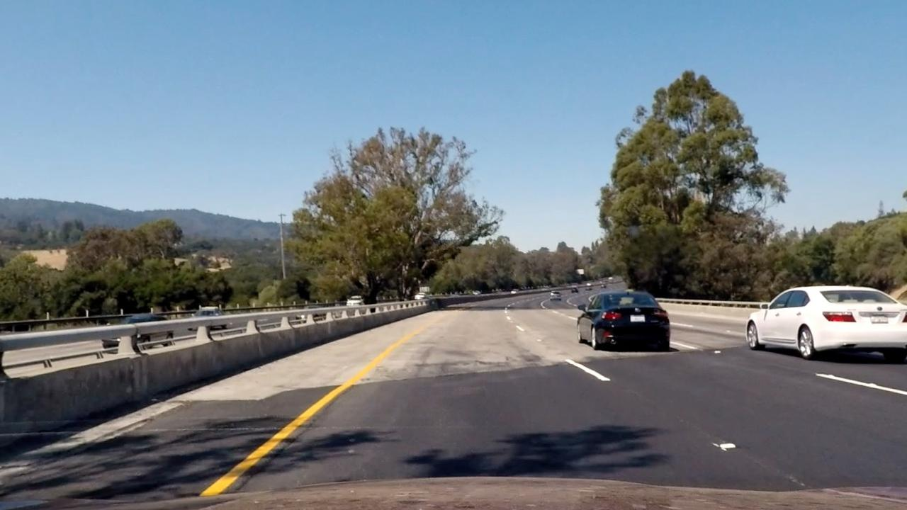
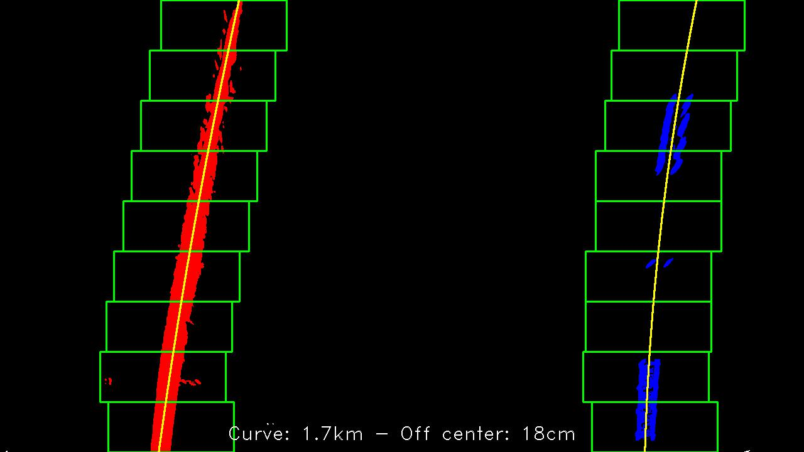
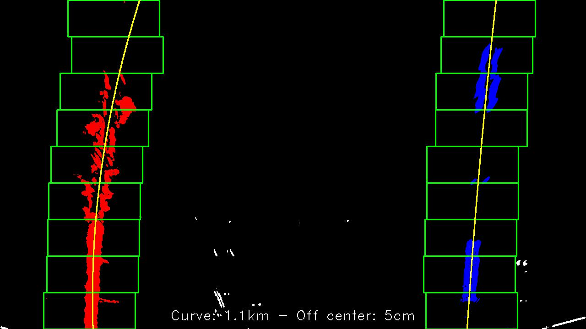
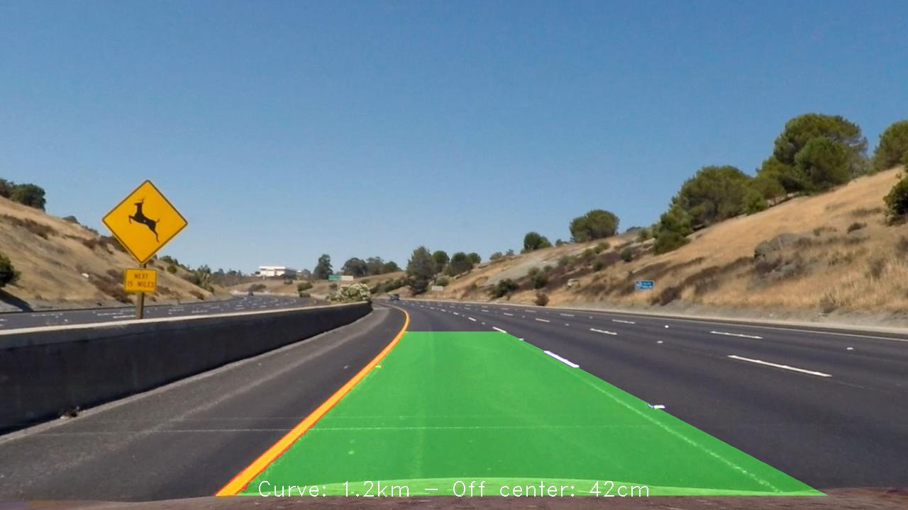
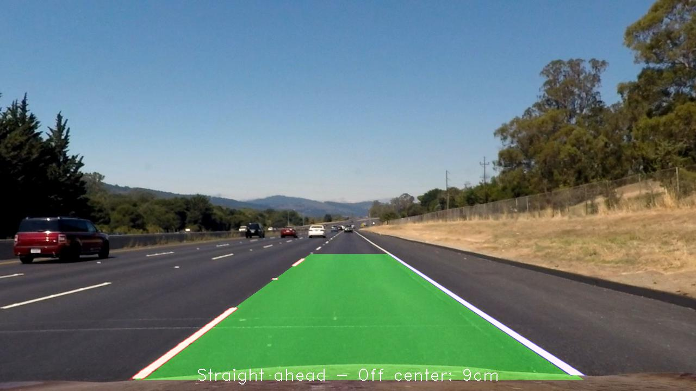
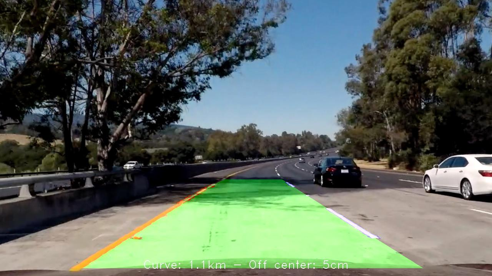
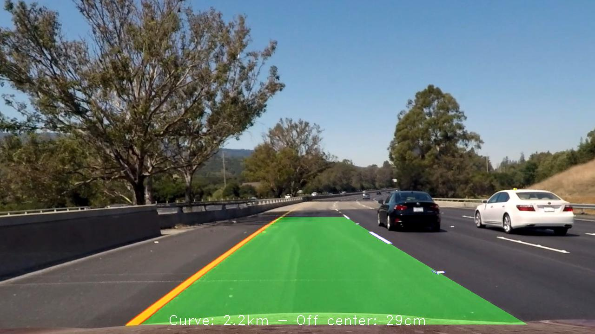

### Writeup / README

#### 1. Provide a Writeup / README that includes all the rubric points and how you addressed each one.  You can submit your writeup as markdown or pdf.  [Here](https://github.com/udacity/CarND-Advanced-Lane-Lines/blob/master/writeup_template.md) is a template writeup for this project you can use as a guide and a starting point.  

You're reading it!

### Camera Calibration

#### 1. Briefly state how you computed the camera matrix and distortion coefficients. Provide an example of a distortion corrected calibration image.

The code for this step is contained in `camera_calibration.py`. This file contains a class `ChessboardImage`. Given an 
image and a chessboard size, it will find the `image_points` using `cv2.findChessboardCorners()`. The `object_points` 
are calculated in `create_object_points()`, which generates (x, y, z) coordinates. As the image of the chessboard is flat, 
`z` is 0 for all object points.


The actual calibration of the camera happens in the `Camera` class in the same file. This class takes a list
of images, and uses the `ChessboardImage` class to find the `image_points` and `object_points`. It passes these
to the `cv2.calibrateCamera()` to calculate the `matrix` and `distortion_coefficients`.

This `Camera` class also contains an `undistort()` method to actually perform distortion-correction on 
any image. It applies `cv2.undistort()` on the image using the `matrix` and `distortion_coefficients` that were 
found during calibration.  

Before                                   | After
:---------------------------------------:|:------------------------------------------------------:
 | 

### Pipeline (single images)

#### 1. Provide an example of a distortion-corrected image.

Using the `Camera` class described in the previous section, I can remove the distortion on the test images:
```python
camera = Camera(images_in_directory('camera_cal'))
test_images = [camera.undistort(image) for image in images_in_directory('test_images')]
```

In the picture below, you can see how the white car is closer than it previously appeared.

Before                                   | After
:---------------------------------------:|:------------------------------------------------------:
 | 


#### 2. Describe how (and identify where in your code) you used color transforms, gradients or other methods to create a thresholded binary image.  Provide an example of a binary image result.

I experimented with a couple of options to identify the pixels belong to the lane markings. These experiments are in 
`experiments_sobel.ipynb`. Once I identified a good strategy, I coded it up in `binary_image.py`.

The relevant part of code is in `def identify_lane_pixels(image)`. Here I extract the red channel from the image 
(from the image in RGB space) and the saturation channel (from the image in HLS color space). I also applied
the Sobel derivative in the `x`-direction on the red image. I then normalized the Sobel derivative to have values
between 0 and 255.

To find the lane pixels, I applied following thresholds:

| Image       | Low | High
:-------------|----:|------:
| Red         | 40  |255 
| Saturation  |130  |255 
| Sobel       | 50  |255 

I created a utility class called `BinaryImage` which allows me to easily do boolean logic with 
binary images. This allowed me to combine the binary images above in a single image as follows:

```python
(red & saturation) | sobel
```

So I retain the pixels that are _red_ and _saturated_ enough, or if the absolute sobel value is large enough. 
This results in the following image: 

Before                                   | After
:---------------------------------------:|:------------------------------------------------------:
 | 


#### 3. Describe how (and identify where in your code) you performed a perspective transform and provide an example of a transformed image.


The code for the perspective transform is in `perspective.py`. The `RegionOfInterest` defines
the source and destination points for a perspective transform. I hardcoded these values based on the example
images.

| Source        | Destination   | 
|:-------------:|:-------------:| 
| 200, 700      | 200, 720      | 
| 562, 468      | 200, 0        |
| 718, 468      | 1000, 0       |
| 1080, 700     | 1000, 720     |

The `Perspective` class contains the code to calculate the transformation matrices, and
actually apply the transformation.

```python
class Perspective:
    def __init__(self, region_of_interest):
        self.region = region_of_interest
        self.transform = cv2.getPerspectiveTransform(
            self.region.perspective, self.region.rectangle
        )
        self.inverseTransform = cv2.getPerspectiveTransform(
            self.region.rectangle, self.region.perspective
        )

    def bird_view(self, image):
        return cv2.warpPerspective(np.copy(image), self.transform, image_size(image))

    def perspective_view(self, image):
        return cv2.warpPerspective(np.copy(image), self.inverseTransform, image_size(image))
```

I found these values after experimentation with different values. (See `experiments_perspective.ipynb`). I verified
that the straight lines test image retained its straight lines after transformation:


I aimed the left-lane and the right-lane to be at respectively x-position 200 and x-position 1000. This means
that the width is 800 pixels for a 3.7 meter wide lane. The center of the lane is at x-position 600. This will be relevant
when calculating the curvature and off-centeredness in a later section. 

#### 4. Describe how (and identify where in your code) you identified lane-line pixels and fit their positions with a polynomial?

I created a couple of classes in `binary_image.py` to identify the lane pixels and fit them with a polynomial. 

1. In the `BinaryImage` class, we first find the starting position of the lanes in `def lane_bases()`. Here I find the
peak in the histogram. I do this in the lower-left quadrant and the lower-right quadrant. This way I have the starting positions
for the left-lane and the right lane respectively.
2. Using the binary image and the starting position I can create a `Lane` class
    
    ```python
    (left_x, right_x) = binary.lane_bases()
    left_lane = Lane(binary, left_x)
    right_lane = Lane(binary, right_x)
    ```

3. The `Lane` class will use the `PointFinder` class to find the relevant points. As there is no previous known
polynomial, it will use the sliding window technique (`def nonzero_xy_using_windows()`). 
    
    ```python
    x_midpoint = self.initial_x_midpoint
    for y_range in self.binary_image.window_y_positions():
        window = Window(self.binary_image, x_midpoint, y_range)
        yield window
        x_midpoint = window.new_x_midpoint
    ```

4. In each window, we collect all the points that fall in bounds (`nonzero_xy`). If there are sufficient points within the 
window, we can calculate a new midpoint of the lane.

    ```python
    @property
    def nonzero_xy(self):
        (nonzero_x, nonzero_y) = self.binary_image.nonzero_xy
        indices = np.flatnonzero((nonzero_x >= self.x_min) &
                                 (nonzero_x < self.x_max) &
                                 (nonzero_y >= self.y_min) &
                                 (nonzero_y < self.y_max))
        return nonzero_x[indices], nonzero_y[indices]
    ```

5. Once we have all the non-zero points for the lane, we can fit a polynomial using `np.polyfit`.

    ```python
        @property
        def polynomial(self):
            (lane_x, lane_y) = self.nonzero_xy
            return np.polyfit(lane_y, lane_x, 2)
    
    ```
 
On this image I annotated several interesting pieces:



* The green boxes are the sliding windows I used. Going from the bottom to the image to the top.
* The left lane identified its relevant pixels in red
* The right lane identified its relevant pixels in blue
* White pixels were ignored.
* The yellow line is the fitted polynomial. 

#### 5. Describe how (and identify where in your code) you calculated the radius of curvature of the lane and the position of the vehicle with respect to center.

To calculate the radius and the position in respect to center, I took following values:
* In the X-direction, 800 pixels is about 3.7 meters (lane width)
* In the Y-direction, 720 pixels is about 27 meters (about 6 car lengths)

1. I use these values to fit scaled polynomials in `def scaled_polynomial()`

    ```python
    np.polyfit(YM_PER_PIX * lane_y, XM_PER_PIX * lane_x, 2)
    ```
2. I can use this scaled polynomial to calculate the curvature of a lane. I do this at the bottom of the image, 
closest to the car. In the output images and the video I calculate the average of the left-curve and right-curve.

    ```python
   def curve_at_bottom(self):
        (a, b, _) = self.scaled_polynomial
        y = self.binary_image.height * YM_PER_PIX
        return np.power((1 + np.square(2 * a * y + b)), 3 / 2) / np.abs(2 * a)
    ```

3. The calculation of the position in relationship to the center, is in `def deviation_from_center()` I calculate where 
the left and right lane intersect with the bottom of the image. I can then calculate where
the middle is of those lane markings in the image:

    ```python
    y = self.binary_image.height * YM_PER_PIX
    (a1, b1, c1) = self.scaled_polynomial
    left_lane_bottom = (a1 * y ** 2 + b1 * y + c1)
    (a2, b2, c2) = right_lane.scaled_polynomial
    right_lane_bottom = (a2 * y ** 2 + b2 * y + c2)
    actual_middle = left_lane_bottom + ((right_lane_bottom - left_lane_bottom) / 2)
    ```
4. I can compare this with the expected middle of the lane. Because of my
 perspective transformation, I expect the perfect middle to be at x-position 600. (or 2.775 meters).
 
    ```python
    perfect_middle = MIDPOINT_X * XM_PER_PIX
    ```
 
5. Comparing these values, I can calculate the deviation from the perfect center:

    ```python
    np.abs(actual_middle - perfect_middle)
    ```

In the following image, I detected the car to be pretty close to the center (5 centimeters off), while in a fairly
slow bend (radius of 2.7 kilometers).




#### 6. Provide an example image of your result plotted back down onto the road such that the lane area is identified clearly.

I put all the steps together in `pipeline.py`, in `def pipeline()`.

I first correct the distortion and apply a perspective transform:

```python
undistorted_image = camera.undistort(image)
bird_view_image = perspective.bird_view(undistorted_image)
```  

I look for the left and right lane:
```python
left_lane, right_lane = self.find_lanes(bird_view_image)
```

Finding the lanes, happens by first identifying the starting positions, and using the sliding window technique. If we found
a polynomial in the previous frame however, we'll use that instead of the windows.
```python
def find_lanes(self, bird_view_image):
    lane_pixels = identify_lane_pixels(bird_view_image)
    (left_x, right_x) = lane_pixels.lane_bases()
    left_lane = Lane(lane_pixels, left_x, self.previous_polynomial_left)
    right_lane = Lane(lane_pixels, right_x, self.previous_polynomial_right)
```

Once I found the lanes, I can draw some annotations on a new black image.

 ```python
bird_view_lane_image = np.zeros_like(bird_view_image).astype(np.uint8)
left_lane.draw_fill_on_image(bird_view_lane_image, other_lane=right_lane)
left_lane.draw_identified_pixels_on_image(bird_view_lane_image, [255, 0, 0])
right_lane.draw_identified_pixels_on_image(bird_view_lane_image, [0, 0, 255])
```

This annotated image can be transformed back using the perspective transform, and
combined with the original image.

```python
perspective_view_lane_image = perspective.perspective_view(bird_view_lane_image)
combined_image = cv2.addWeighted(undistorted_image, 1, perspective_view_lane_image, 0.4, 0)
left_lane.draw_summary(combined_image, right_lane) # curvature information
return combined_image
```

The final result looks as follows:

|  |  |
|:---:|:---:|
|  | 
|  | 
|  | 

---

### Pipeline (video)

#### 1. Provide a link to your final video output.  Your pipeline should perform reasonably well on the entire project video (wobbly lines are ok but no catastrophic failures that would cause the car to drive off the road!).

Here's a [link to my video result](./output_videos/project_video.mp4)


<figure>
  <video>
    <source src="./output_videos/project_video.mp4" type="video/mp4">
  </video>
</figure>

---

### Discussion

#### 1. Briefly discuss any problems / issues you faced in your implementation of this project.  Where will your pipeline likely fail?  What could you do to make it more robust?

There are still some things I could do to improve the detection of the lanes. In the more difficult example videos, it starts 
detecting a lane of only a few centimeters wide. It's probably safe to assume that all lanes are a certain width and parallel
to eachother. I currently don't take any of this 'real-world' knowledge into account.

In the challenge video, the camera got blinded a couple of times. If I could somehow normalize the lightning/colors first,
it might work better. 